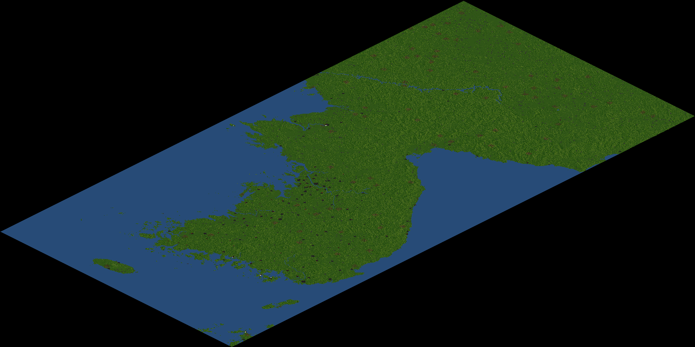

# Korean peninsula scenario
This is a Korean peninsula OpenTTD scenario with major cities.  
Its size is 4096x2048. Some regions are cropped due to the size.  
Note that there is no industries in this scenario.  
Need Korean Town Names NewGRF(544b0101).  
This is made with Korean peninsular heightmap(00001922)  

# Screenshot

# License
GPL v3